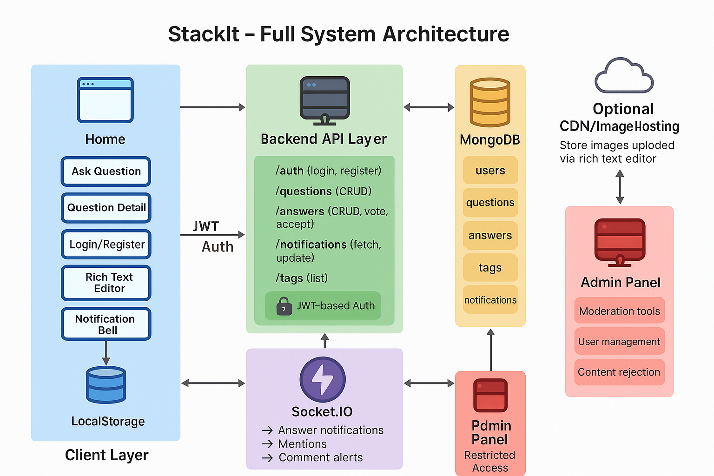

# 🧩 StackIt – Minimal Q&A Forum Platform



StackIt is a **clean, collaborative question-and-answer platform** designed to enable structured knowledge sharing in any community.  
It focuses on simplicity, user-friendliness, and rich content creation.

---

## ✨ Features

✅ **Ask Questions**
- Rich text formatting (bold, lists, images, links)
- Multi-tag selection

✅ **Answer Questions**
- Markdown & WYSIWYG editor
- Voting and accepted answers

✅ **Notifications**
- Real-time updates when:
  - Someone answers your question
  - Someone comments on your answer
  - You’re mentioned via @username

✅ **Admin Moderation**
- Reject inappropriate content
- Ban users
- Broadcast announcements
- Export activity reports

✅ **Responsive Design**
- Works seamlessly on desktop and mobile

---

## 🏗️ System Architecture


**Architecture Overview:**
- **Frontend:** React.js with React Router, Quill.js editor, Tailwind CSS
- **Backend:** Node.js + Express.js REST API
- **Database:** MongoDB
- **Realtime:** Socket.IO for live notifications
- **Authentication:** JWT tokens
- **CDN:** (Optional) Cloud storage for uploaded images

---

## 🛠️ Technologies Used

- **Frontend:**
  - React.js
  - React Router
  - React Quill
  - Axios
  - Tailwind CSS

- **Backend:**
  - Node.js
  - Express.js
  - Socket.IO
  - Mongoose (MongoDB ODM)
  - JSON Web Tokens

- **Database:**
  - MongoDB Atlas

- **Dev Tools:**
  - ESLint + Prettier
  - Git & GitHub Actions

---

## 🚀 Getting Started

Follow these steps to run StackIt locally.

### 📥 Clone the Repository

```bash
git clone https://github.com/your-username/stackit.git
cd stackit
